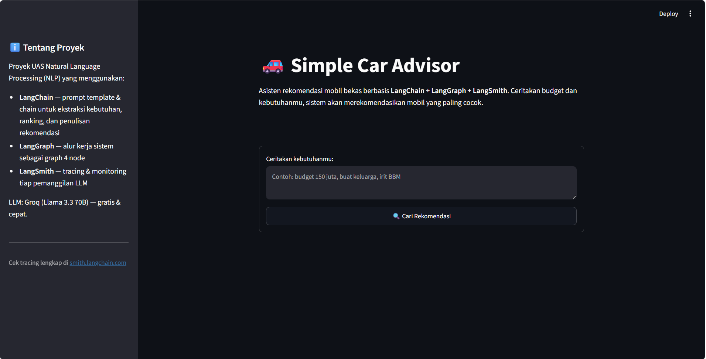
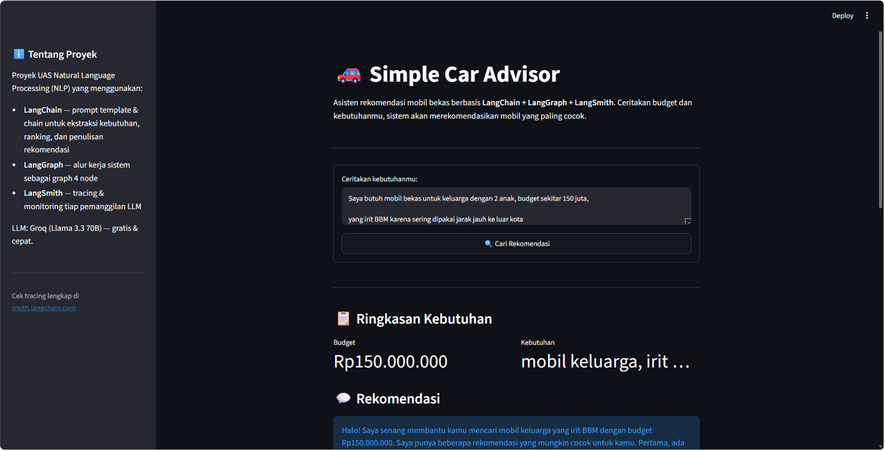
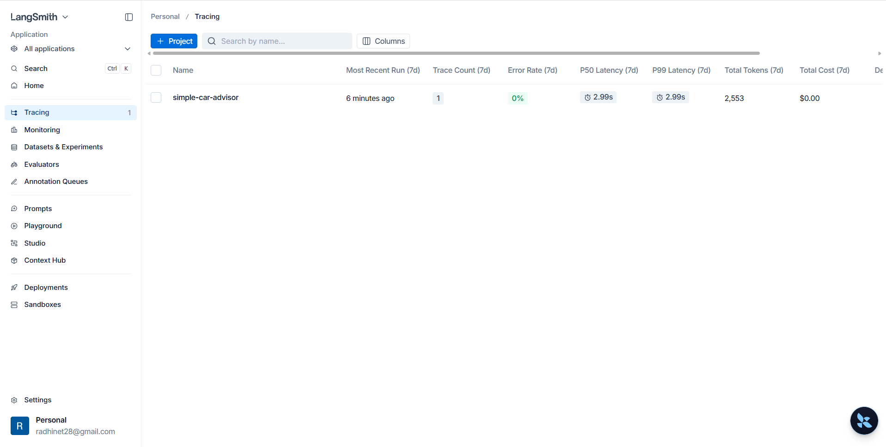

# 🚗 Simple Car Advisor

Asisten rekomendasi mobil bekas berbasis **NLP/LLM**. Cukup ceritakan budget dan kebutuhanmu dalam bahasa natural (misalnya: *"budget 150 juta, buat keluarga, irit BBM"*), sistem akan menganalisis dan merekomendasikan 2-3 mobil bekas yang paling cocok lengkap dengan alasannya.

Proyek ini dibuat untuk memenuhi **Ujian Akhir Semester (UAS) — Mata Kuliah Natural Language Processing (NLP)**, dengan fokus implementasi tiga library wajib: **LangChain**, **LangGraph**, dan **LangSmith**.

---

## 📌 Daftar Isi

- [Demo](#-demo)
- [Library yang Digunakan](#-library-yang-digunakan)
- [Arsitektur Sistem](#-arsitektur-sistem)
- [Struktur Folder](#-struktur-folder)
- [Cara Menjalankan](#-cara-menjalankan)
- [Contoh Penggunaan](#-contoh-penggunaan)
- [Screenshot](#-screenshot)
- [Video Demo](#-video-demo)
- [Pembuat](#-pembuat)

---

## 🎬 Demo

Aplikasi berjalan sebagai **web app interaktif** menggunakan Streamlit — user cukup mengetik kebutuhan dalam satu kalimat, sistem akan memproses lewat 4 tahap (graph) dan menampilkan rekomendasi mobil terbaik secara visual.

---

## 🧠 Library yang Digunakan

| Library | Fungsi dalam Proyek Ini |
|---|---|
| **LangChain** | Membangun prompt template & chain untuk 3 tugas: (1) ekstraksi budget & kebutuhan dari kalimat bebas user, (2) membandingkan & meranking kandidat mobil, (3) menulis rekomendasi akhir dalam bahasa natural |
| **LangGraph** | Menyusun seluruh alur kerja sistem sebagai *state graph* dengan 4 node berurutan, memastikan proses berjalan terstruktur dan dapat dipantau di setiap tahap |
| **LangSmith** | Melakukan tracing & monitoring otomatis terhadap setiap pemanggilan LLM, digunakan untuk debugging prompt dan evaluasi kualitas rekomendasi yang dihasilkan |

**LLM yang digunakan:** [Groq](https://groq.com) dengan model `llama-3.3-70b-versatile` — dipilih karena gratis, cepat, dan tidak memerlukan kartu kredit.

---

## 🏗️ Arsitektur Sistem
┌─────────────────────┐

│      User Input      │

└──────────┬───────────┘

↓

┌──────────────────────────────┐

│  Node 1: Ekstrak Kebutuhan    │  ← LangChain (LLM ekstrak budget & kebutuhan jadi JSON)

└──────────┬───────────────────┘

↓

┌──────────────────────────────┐

│  Node 2: Filter Kandidat      │  ← Python biasa (filter data mobil sesuai budget)

└──────────┬───────────────────┘

↓

┌──────────────────────────────┐

│  Node 3: Ranking               │  ← LangChain (LLM bandingkan & urutkan 3 mobil terbaik)

└──────────┬───────────────────┘

↓

┌──────────────────────────────┐

│  Node 4: Tulis Rekomendasi    │  ← LangChain (LLM tulis rekomendasi bahasa natural)

└──────────┬───────────────────┘

↓

┌─────────────────────┐

│   Output ke User      │

└──────────────────────┘
(Seluruh proses di atas dipantau & di-trace otomatis oleh LangSmith)

---

## 📂 Struktur Folder
simple-car-advisor/

│

├── data/

│   └── mobil.json              # 20 data mobil bekas (sintetis, dibuat dengan bantuan LLM)

│

├── src/

│   ├── init.py

│   ├── state.py                  # Definisi state yang mengalir di LangGraph

│   ├── nodes.py                   # 4 node utama (ekstrak, filter, ranking, tulis)

│   ├── graph.py                    # Susunan LangGraph (node & edges)

│   ├── chains.py                    # LangChain prompt templates & chains

│   └── config.py                     # Setup environment & LangSmith tracing

│

├── app.py                              # Entry point aplikasi (Streamlit)

├── requirements.txt                     # Daftar dependencies

├── .env.example                          # Template environment variables

├── .gitignore

└── README.md

---

## ⚙️ Cara Menjalankan

### 1. Clone repository

```bash
git clone <url-repo-kamu>
cd simple-car-advisor
```

### 2. Buat virtual environment (disarankan)

```bash
python -m venv venv
```

Aktifkan:

```bash
# Windows
venv\Scripts\activate

# Mac/Linux
source venv/bin/activate
```

### 3. Install dependencies

```bash
pip install -r requirements.txt
```

### 4. Setup API Key (Gratis)

Salin file `.env.example` menjadi `.env`:

```bash
cp .env.example .env
```

Lalu isi `.env` dengan API key kamu:

| API Key | Cara Mendapatkan | Biaya |
|---|---|---|
| `GROQ_API_KEY` | Daftar di [console.groq.com](https://console.groq.com) → API Keys → Create API Key | Gratis |
| `LANGCHAIN_API_KEY` | Daftar di [smith.langchain.com](https://smith.langchain.com) → Settings → API Keys | Gratis |

Isi file `.env`:

```env
GROQ_API_KEY=isi_key_groq_kamu_disini
LANGCHAIN_API_KEY=isi_key_langsmith_kamu_disini
LANGCHAIN_TRACING_V2=true
LANGCHAIN_PROJECT=simple-car-advisor
```

### 5. Jalankan aplikasi

```bash
streamlit run app.py
```

Browser akan otomatis terbuka ke `http://localhost:8501`.

---

## 💬 Contoh Penggunaan

**Input: Saya butuh mobil bekas untuk keluarga dengan 2 anak, budget sekitar 150 juta,

yang irit BBM karena sering dipakai jarak jauh ke luar kota**

**Proses di balik layar:**

| Tahap | Hasil |
|---|---|
| Ekstraksi (Node 1) | `budget: 150.000.000`, `kebutuhan: "mobil keluarga, irit BBM, untuk perjalanan jauh"` |
| Filter (Node 2) | Menyaring mobil dengan harga ≤ ±165 juta dari 20 data tersedia |
| Ranking (Node 3) | Memilih 3 mobil terbaik berdasarkan kapasitas penumpang & konsumsi BBM |
| Rekomendasi (Node 4) | Paragraf rekomendasi dalam Bahasa Indonesia yang natural |

**Contoh prompt lain yang bisa dicoba: Budget 100 juta buat city car, sendiri aja gak perlu besar, yang penting irit dan gampang parkir
Lagi cari mobil keluarga premium, budget sampai 250 juta, mending yang automatic dan masih kinclong**

---

## 📸 Screenshot

> *Tambahkan screenshot aplikasi kamu di sini sebelum submit*

| Tampilan Utama Streamlit | Hasil Rekomendasi |
|---|---|
|  |  |

| Tracing LangGraph di LangSmith |
|---|
|  |

---

## 🎥 Video Demo

📺 Link video UAS (Google Drive): **[tambahkan link di sini]**

Video berisi:
- Penjelasan teori LangChain, LangGraph, dan LangSmith (15-25 menit)
- Penjelasan arsitektur proyek dan demo langsung aplikasi (15-25 menit)

---

## 👤 Pembuat

| | |
|---|---|
| **Nama** | [Radhi Rabbani] |
| **NIM** | [233510016] |
| **Mata Kuliah** | Natural Language Processing (NLP) |
| **Semester** | [6] |

---

## 📝 Catatan

- Data mobil pada `data/mobil.json` bersifat **sintetis** (dibuat dengan bantuan LLM berdasarkan referensi harga pasaran umum), digunakan murni untuk keperluan demonstrasi sistem, bukan data jual-beli aktual.
- LLM yang digunakan (Groq) bersifat gratis dan tidak memerlukan kartu kredit, sehingga proyek ini dapat dijalankan ulang tanpa biaya.

